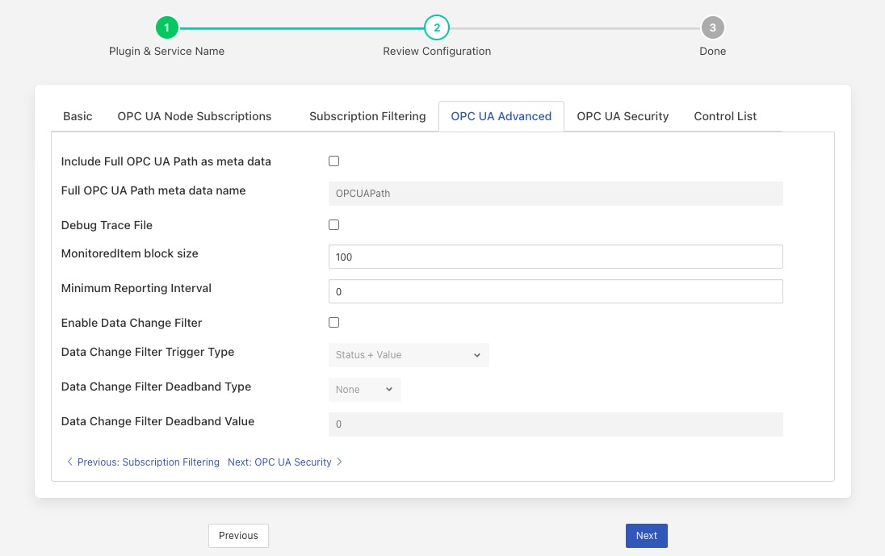
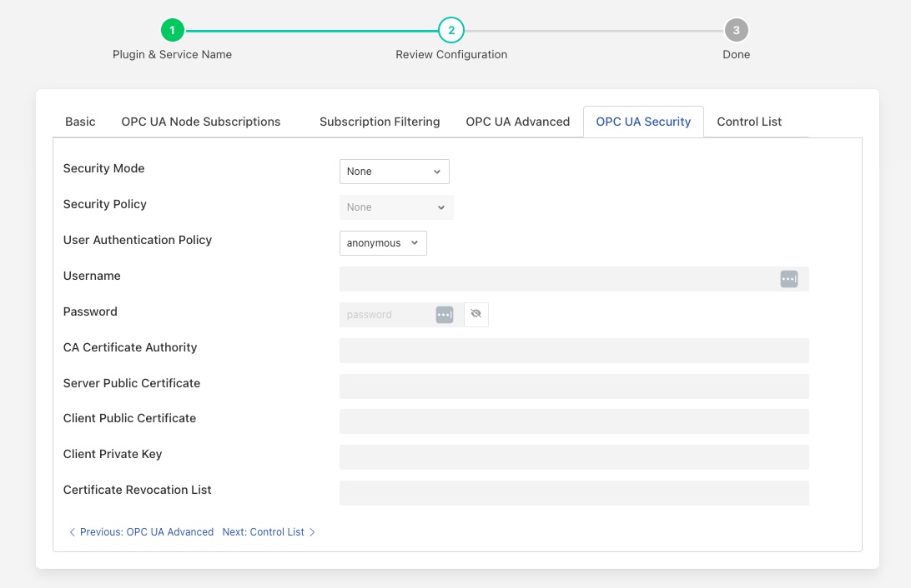
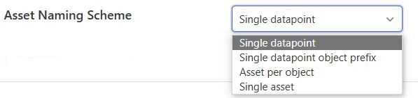

.. Images
.. |opcua_1| image:: images/opcua_1.jpg

.. |opcua_2| image:: images/opcua_2.jpg
.. |opcua_3| image:: images/opcua_3.jpg
.. |opcua_4| image:: images/opcua_4.jpg

.. |UaExpert| raw:: html

    <a href="https://www.unified-automation.com/downloads/opc-ua-clients.html">Ua Expert</a>

.. |S2OPCUA| raw:: html

    <a href="https://www.s2opc.com">S2OPC safe &amp; secure</a>

.. |generate_certs| raw:: html

    <a href="https://gitlab.com/systerel/S2OPC/-/blob/master/samples/ClientServer/data/cert/generate_certs.sh"><code>generate_certs.sh</code> example script</a>

OPC/UA Safe & Secure South Plugin
=================================

The *fledge-south-s2opcua* plugin allows Fledge to connect to an OPC/UA server and subscribe to changes in the objects within the OPC/UA server. This plugin is very similar to the *fledge-south-opcua* plugin but is implemented using a different underlying OPC/UA open source library, |S2OPCUA| from Systerel. The major difference between the two is the ability of this plugin to support secure endpoints with the OPC/UA server.

A south service to collect OPC/UA data is created in the same way as any other south service in Fledge.

  - Use the *South* option in the left hand menu bar to display a list of your South services

  - Click on the + add icon at the top right of the page

  - Select the *s2opcua* plugin from the list of plugins you are provided with

  - Enter a name for your south service

  - Click on *Next* to configure the OPC/UA plugin

The configuration parameters that can be set on this page are divided into a set of tabs;

  - Default Configuration

  - OPC UA Advanced

  - OPC UA Security

The default configuration tab is shown below

+-----------+
| |opcua_1| |
+-----------+

On this tab a number of configuration parameters are available;

  - **Asset Name**: This is a prefix that will be applied to all assets that are created by this plugin. The OPC/UA plugin creates a separate asset for each data item read from the OPC/UA server. This is done since the OPC/UA server will deliver changes to individual data items only. Combining these into a complex asset would result in assets that do only contain one of many data points in each update. This can cause upstream systems problems with the every changing asset structure.

  - **OPCUA Server URL**: This is the URL of the OPC/UA server from which data will be extracted. The URL should be of the form opc.tcp://..../

  - **OPCUA Object Subscriptions**: The subscriptions are a set of locations in the OPC/UA object hierarchy that defined which data is subscribed to in the server and hence what assets get created within Fledge. A fuller description of how to configure subscriptions is shown below.

  - **Min Reporting Interval**: This control the minimum interval between reports of data changes in subscriptions. It sets an upper limit to the rate that data will be ingested into the plugin and is expressed in milliseconds.

  - **Asset Naming Scheme**: The plugin can ingest data into a number of different assets based on the selection of the asset naming scheme

    +-----------+
    | |opcua_5| |
    +-----------+

     - *Single datapoint* An asset will be created for each variable read from the OPC/UA server. The asset will contain a single datapoint whose name will be taken from the browse name of the variable read. The asset name will be created by appending the browse name of the variable to the fixed asset name prefix defined in the *Asset Name* configuration option above.

     - *Single datapoint object prefix* An asset will be created for each variable read from the OPC/UA server. The asset will contain a single datapoint whose name will be taken from the browse name of the variable read. The asset name will be created by appending the browse name of the variable to the browse name of the variables parent object.

     - *Asset per object* An asset will be created for each OPC/UA object that is subscribed to. That asset will be named using the browse name of the OPC/UA object and will contain a datapoint per variable within the OPC/UA object. The name of the datapoint will be the browse name of the variable.

     - *Single asset* A single asset will be created with all the variables read from the OPC/UA server as datapoints within that asset. The asset name will be taken from the *Asset Name* configuration item and the datapoint name from the browse name of the OPC/UA variable.

     When an asset is created that has multiple datapoints within it, all datapoints may not be included in any single reading as the plugin only gets data that has changed since the last reading has been taken.

     The plugin uses the browse names of the OPC/UA variables to name the datapoints with an asset; however there is no requirement for the browse names to be unique. The plugin resolves this by detecting duplicates browse names and if one is found appending the node ID to the browse name to create a unique datapoint name. This is important for both *Single datapoint* and *Single Asset* modes as in the first case the asset name is the same as the datapoint name and is global for all OPC/UA variables that are monitored. The result of this would be that the same asset name and datapoint name would be used to store multiple OPC/UA variables. In the case of *Single Asset* mode the datapoints names are kept within a single asset and hence an error would occur if two datapoints had the same name.

    +-----------+
    | |opcua_2| |
    +-----------+

The Filtering tab allows setting the filtering config to include/exclude the OPCUA nodes to subscribe to.

+-------------------+
| |opcua_filtering| |
+-------------------+

  - **Regular expression**: The regular expression to be matched against the Browse Name of the node. The regex has to match the browse name completely.
  - **Scope**: Specifies scope of the node filtering. There are 3 options here:
    - Object: This indicates that matching has to be done against the browse name of object nodes. Variable nodes under matching objects are included anyway without any further checks.
    - Variable: This option indicates that all variable nodes are checked against the filtering configuration. Object nodes are always traversed.
    - Object and Variable: This option is a combination of above 2 options. Object nodes that don't have a matching browse name are not traversed.
  - **Filter action**: Specifies whether a matching node is to be included or not.

The OPC UA Advanced tab allows advanced configuration parameters to be set.

+------------------+
| |opcua_advanced| |
+------------------+

  - **Include Full OPC UA Path as meta data**: If enabled, the full OPC UA path will be added to every reading as a separate datapoint.
    The path is constructed using the Browse Name of every Node in the path from the OPC UA standard *Objects* folder down to the subscribed Node.
    The delimiter between path segments is the forward slash ("/").
    The path always begins with a forward slash.
    The path does not include the *Objects* folder or the subscribed Node.
  - **Full OPC UA Path meta data name**: The data point name to use when adding the full OPC UA path to every reading. Default is *OPCUAPath*.
  - **Debug Trace File**: Enable the S2OPCUA OPCUA Toolkit trace file for debugging. If enabled, log files will appear in the directory */usr/local/fledge/data/logs*.

The OPC UA Security tab contains a set of configuration items that is used for setting the security between the plugin and the OPC UA Server.

+------------------+
| |opcua_security| |
+------------------+

  - **Security Mode**: Specify the OPC/UA security mode that will be used to communicate with the OPC/UA server.

    +-----------+
    | |opcua_3| |
    +-----------+

  - **Security Policy**: Specify the OPC/UA security policy that will be used to communicate with the OPC/UA server.

    +-----------+
    | |opcua_4| |
    +-----------+

  - **User Authentication Policy**: Specify the user authentication policy that will be used when authenticating the connection to the OPC/UA server.

  - **Username**: Specify the username to use for authentication. This is only used if the *User authentication policy* is set to *username*.

  - **Password**: Specify the password to use for authentication. This is only used if the *User authentication policy* is set to *username*.

  - **CA Certificate Authority**: The name of the root certificate authorities certificate file in DER format. This is the certificate authority that forms the root of trust and signs the certificates that will be trusted. If using self-signed certificates this should be left blank.

  - **Server Public Certificate**: The name of the public certificate of the OPC/UA server specified in the *OPCUA Server URL*. This must be a DER format certificate file. It must be signed by the certificate authority unless you are using self-signed certificates.

  - **Client Public Certificate**: The name of the public certificate of the OPC/UA client application, that is, this plugin. This must be a DER format certificate file. It must be signed by the certificate authority unless you are using self-signed certificates.

  - **Client Private Key**: The name of the private key of the client application, that is, the private key the plugin will use. This must be a PEM format key file.

  - **Certificate Revocation List**: The name of the certificate authority's Certificate Revocation List. This is a DER format certificate. If using self-signed certificates this should be left blank.

Subscriptions
-------------

Subscriptions to OPC/UA objects are stored as a JSON object that contents an array named "subscriptions." This  array is a set of OPC/UA nodes that will control the subscription to variables in the OPC/UA server. Each element in the array is an OPC/UA node id, if that node is is the id of a variable then that single variable will be added to the subscription list. If the node id is not a visible, then the plugin will recurse down the object tree below that node and add every variable in finds in this tree to the subscription list.

A subscription list which gives the root node of the OPC/UA server will cause all variables within the server to be added to the subscription list. Care however should be taken as this may be a large number of assets.

Subscription examples
~~~~~~~~~~~~~~~~~~~~~

.. code-block:: console

    {"subscriptions":["5:Simulation","2:MyLevel"]}

We subscribe to

 - 5:Simulation is a node name under ObjectsNode in namespace 5

 - 2:MyLevel is a variable under ObjectsNode in namespace 2

.. code-block:: console

    {"subscriptions":["5:Sinusoid1","2:MyLevel","5:Sawtooth1"]}

We subscribe to

 - 5:Sinusoid1 and 5:Sawtooth1 are variables under ObjectsNode/Simulation in namespace 5

 - 2:MyLevel is a variable under ObjectsNode in namespace 2

.. code-block:: console

    {"subscriptions":["2:Random.Double","2:Random.Boolean"]}

We subscribe to

 - Random.Double and Random.Boolean are variables under ObjectsNode/Demo both in namespace 2

Object names, variable names and namespace indices can be easily retrieved browsing the given OPC/UA server using OPC UA clients, such as |UaExpert|.

Certificate Management
----------------------

OPC UA clients and servers use X509 certificates to confirm each other's identities and to enable digital signing and data encryption.
Certificates are often issued by a Certificate Authority (CA) which means either the client or the server could reach out to the CA to confirm
the validity of the certificate if it chooses to.

The configuration described above uses the names of certificates that will be used by the plugin.
These certificates must be loaded into the Fledge Certificate Store manually and named to match the names used in the configuration before the plugin is started.
When entering certificate and key file names, do not include directory names or file extensions (*.der* or *.pem*).

Typically the Certificate Authorities certificate is retrieved and uploaded to the Fledge Certificate Store along with the certificate from the OPC/UA server that has been signed by that Certificate Authority. A public/private key pair must also be created for the plugin and signed by the Certificate Authority. These are uploaded to the Fledge Certificate Store.

`OpenSSL <https://www.openssl.org>`_ may be used to generate and convert the keys and certificates required.
An |generate_certs| to do this is available as part of the underlying |S2OPCUA| library.

Certificate Requirements
~~~~~~~~~~~~~~~~~~~~~~~~

Certificates must be X509 Version 3 certificates and must have the following field values:

.. list-table::
   :header-rows: 1

   * - Certificate Field
     - Value
   * - Version
     - V3
   * - Subject
     - This field must include a Common Name (*CN=*) which is a human-readable name such as *S2OPCUA South Plugin*. Do not use your device hostname.
   * - Subject Alternative Name
     - URI= fledge:south:s2opcua, DNS= *deviceHostname*
   * - Key Usage
     - Digital Signature, Key Encipherment, Non Repudiation, Data Encipherment
   * - Extended Key Usage
     - Client Authentication

Self-Signed Certificates
------------------------

A common configuration is to use self-signed certificates which are issued by your own systems and cannot be validated against a CA.
For this to work, the OPC UA client and server must each have a copy of the other's certificate in their Trusted Certificate stores.
This task must be done by a system manager who is creating the device configuration.
By copying certificates, the system manager is confirming that the client and server can legitimately communicate with each other.

Creating a Self-Signed Certificate
~~~~~~~~~~~~~~~~~~~~~~~~~~~~~~~~~~

There is a very useful online tool for creating self-signed certificates called `CertificateTools <https://certificatetools.com>`_.
You can watch a demonstration of CertificateTools on `YouTube <https://www.youtube.com/watch?v=O9-Ld_ceL0E>`_.
This section will walk you through the necessary steps to create a self-signed certificate for the S2OPCUA South plugin which is the OPC UA Client.

The `CertificateTools <https://certificatetools.com>`_ main page is divided into sections.
You can leave many of the sections at their default values.
Here are the required entries for each section:

Private Key
###########

Leave the default values as-is: *Generate PKCS#8 RSA Private Key* and *2048 Bit*. Leave *Encrypt* unchecked.

Subject Attributes
##################

In *Common Names*, enter a human-readable name such as *S2OPCUA South Plugin*. Click *Add*.

Edit *Country*, *State*, *Locality* and *Organization* as you wish.
We recommend:

* Country: US
* State: CA
* Locality: Menlo Park
* Organization: Dianomic

Subject Alternative Name
########################

Set the drop-down to *DNS*.
Enter the hostname of your Fledge device.
This can be an unqualified name, that is, the device hostname without domain name.
Click *Add*.

Set the drop-down to *URI*.
Enter *fledge:south:s2opcua*.
Click *Add*.

x509v3 Extensions
#################

Key Usage
^^^^^^^^^

Click the check boxes to enable *Critical*, *Digital Signature*, *Key Encipherment*, *Non Repudiation* and *Data Encipherment*.

Extended Key Usage
^^^^^^^^^^^^^^^^^^

Click the check boxes to enable *Critical* and *TLS Web Client Authentication*.

Encoding Options
################

Leave at Default.

CSR Options
###########

Leave the first drop-down at *SHA256*.
Change the second drop-down from *CSR Only* to *Self-Sign*.
Doing this will expose drop-downs to set the self-signed certificate expiration time.

Generating the Certificate and Private Key
##########################################

Click *Submit*.
This will create a new section marked by a blue bar labelled *Certificate 0*.

Open *Certificate 0*.
This will reveal a subsection called *Download*.
You will need only two of these files:

* PEM Certificate (filename *cert.crt*)
* PKCS#12 Certificate and Key (filename *cert.pfx*)

When you click the *PKCS#12 Certificate and Key* link, you will be prompted for a password for the private key.
It is acceptable to click *Cancel* to proceed without a password.
Download these two files to a working directory on any computer with OpenSSL installed (you will need OpenSSL to post-process the downloaded files).
You do not need to do this on your Fledge device.
You must do this on a machine that can run the Fledge GUI in a browser;
you will need the browser to import the certificate and key into the Fledge Certificate Store.

.. note::
    The CertificateTools webpage can show you the equivalent OpenSSL commands to perform the self-signed certificate and key generation.
    Look for *OpenSSL Commands* below the blue *Certificate 0* bar.

Post-Processing the Certificate and Private Key
###############################################

Use the OpenSSL command-line utility to convert the certificate and key files to the formats needed for the S2OPCUA South Plugin.

Converting the Certificate File
^^^^^^^^^^^^^^^^^^^^^^^^^^^^^^^

The *PEM Certificate* file (*cert.crt*) is in PEM format.
It must be converted to DER format.
The command is:

.. code-block:: bash

   openssl x509 -inform pem -outform der -in cert.crt -out myclientcert.der

Converting the Private Key File
^^^^^^^^^^^^^^^^^^^^^^^^^^^^^^^

The *PKCS#12 Certificate and Key* file (*cert.pfx*) is in Public-Key Cryptography Standards `PKCS#12 <https://en.wikipedia.org/wiki/PKCS_12>`_ format.
It must be converted to PEM format.
The command is:

.. code-block:: bash

   openssl pkcs12 -in cert.pfx -out myclientkey.pem -nodes

This command will prompt for the Import Password.
If you created a password when you downloaded the PKCS#12 Certificate and Key file, enter it now.
If you did not create a password, hit Enter.

Importing the Certificate and Key Files
~~~~~~~~~~~~~~~~~~~~~~~~~~~~~~~~~~~~~~~

Launch the Fledge GUI.
Navigate to the Certificate Store.
In the upper right corner of the screen, click *Import*.

    +-------------+
    | |certstore| |
    +-------------+

In the *Key* section, click *Choose File* and navigate to the location of the key file *myclientkey.pem*.

In the *Certificate* section, click *Choose File* and navigate to the location of the certificate file *myclientcert.der*.

Click *Import*.

You should use the Certificate Store in the Fledge GUI to import your OPC UA server certificate.
In this case, enter the server certificate file name in the *Certificate* portion of the Import dialog and then click *Import*.
