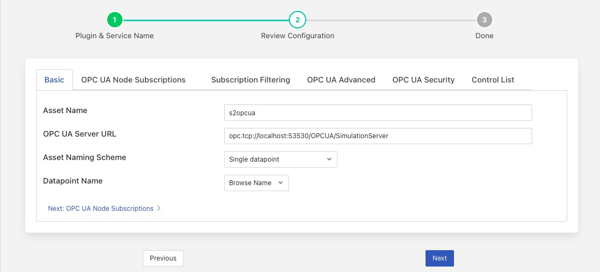
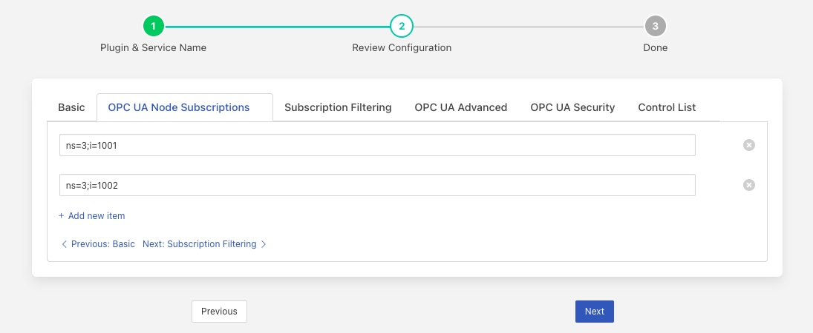

.. Images

.. |opcua_advanced| image:: images/opcua_advanced.jpg
.. |opcua_security| image:: images/opcua_security.jpg

.. |opcua_5| image:: images/opcua_5.jpg
.. |certstore| image:: images/certificatestore-import.jpg

.. |UaExpert| raw:: html

    <a href="https://www.unified-automation.com/downloads/opc-ua-clients.html">Ua Expert</a>

.. |S2OPCUA| raw:: html

    <a href="https://www.s2opc.com">S2OPC safe &amp; secure</a>

.. |generate_certs| raw:: html

    <a href="https://gitlab.com/systerel/S2OPC/-/blob/master/samples/ClientServer/data/cert/generate_certs.sh"> example script</a>

OPC UA Safe & Secure South Plugin
=================================

The *fledge-south-s2opcua* plugin allows Fledge to connect to an OPC UA server and subscribe to changes in Variables within the OPC UA server.
This means the plugin is notified by the OPC UA server when the data values of subscribed Variables change.

The plugin creates a separate Fledge asset with a single data point for each Variable read from the OPC UA server.
This is necessary because the OPC UA server delivers data updates for individual Variables only.
The OPC UA data updates become Fledge data point values.
Combining these updates into fewer complex assets with multiple data points would require grouping together information from several OPC UA data updates.
If any of the OPC UA Object's Variables do not change, there will be no data updates so there is no way to guarantee construction of a complete Fledge asset in this plugin.
This would have caused problems for upstream systems because the asset structure would have been constantly changing.

This *fledge-south-s2opcua* plugin is very similar to the *fledge-south-opcua* plugin but is implemented using a different underlying OPC UA open source library, |S2OPCUA| from Systerel.
The major difference between the two is the ability of this plugin to support secure endpoints with the OPC UA server.

A south service to collect OPC UA data is created in the same way as any other south service in Fledge.

  - Use the *South* option in the left hand menu bar to display a list of your South services

  - Click on the + add icon at the top right of the page

  - Select the *s2opcua* plugin from the list of plugins you are provided with

  - Enter a name for your south service

  - Click on *Next* to configure the OPC UA plugin

The *fledge-south-s2opcua* configuration parameters are divided into a set of tabs:

  - Basic Configuration

  - OPC UA Subscriptions

  - OPC UA Advanced

  - OPC UA Security

Basic Configuration
-------------------
The Basic configuration tab is shown below:

+-----------+
| |opcua_1| |
+-----------+

The following configuration parameters are available:

  - **Asset Name**: This is a prefix that may be applied to assets created by this plugin.
    See the *Asset Naming Scheme* configuration to learn how this *Asset Name* is used.

  - **OPC UA Server URL**: This is the URL of the OPC UA server from which data will be extracted. The URL should be of the form *opc.tcp://..../*

  - **Asset Naming Scheme**: The plugin can ingest data into a number of different assets based on the selection of the asset naming scheme.
    This list of options notes that either the Variable Browse Name or Node Id will be used in asset and datapoint naming.
    The *Datapoint Name* configuration on this tab allows you to choose which of these two properties to use:

    +-----------+
    | |opcua_5| |
    +-----------+

     - *Single datapoint*: An asset will be created for each Variable read from the OPC UA server. The asset will contain a single datapoint whose name will be taken from the Browse Name or Node Id of the Variable read. The asset name will be created by appending the Browse Name or Node Id of the Variable to the fixed asset name prefix defined in the *Asset Name* configuration option above.

     - *Single datapoint object prefix*: An asset will be created for each Variable read from the OPC UA server. The asset will contain a single datapoint whose name will be taken from the Browse Name or Node Id of the Variable read. The asset name will be created by appending the Browse Name or Node Id of the Variable to the Browse Name of the Variable's parent Object.

     - *Asset per object*: An asset will be created for each OPC UA Object that is subscribed to. The asset will be named using the Browse Name of the parent of the OPC UA Object and will contain a datapoint per Variable within the OPC UA Object. The name of the datapoint will be the Browse Name or Node Id of the Variable.

     - *Single asset*: A single asset will be created with all the Variables read from the OPC UA server as datapoints within that asset. The asset name will be taken from the *Asset Name* configuration item. The datapoint name will be the Browse Name or Node Id of the OPC UA Variable.

  - **Datapoint Name**: The OPC UA Variable property to use as the Datapoint name. Options are *Browse Name* (default) and *Node Id*.

Handling Duplicate Browse Names
~~~~~~~~~~~~~~~~~~~~~~~~~~~~~~~

Duplicate Browse Names are not an issue if the *Datapoint Name* configuration is set to *Node Id* because Node Ids are always unique within the OPC UA Server's Address Space.

If the *Datapoint Name* configuration is set to *Browse Name*, however, the plugin uses the Browse Names of the OPC UA Variables to name the datapoints within an asset.
There is no requirement that the Browse Names be unique.
The plugin resolves this by detecting duplicate Browse Names.
If duplicates are found, the Node Id is appended to each Browse Name to create a unique datapoint name.

This is important for both *Single datapoint* and *Single Asset* naming schemes:

  - In the case of the *Single datapoint*, the asset name is the fixed asset name prefix appended by the OPC UA Variable Browse Name.
    Since identical Browse Names may appear in many OPC UA Subscriptions, the asset name prefix/Browse Name combination may not be unique.
  - In the case of *Single Asset*, all datapoints are kept within a single asset.
    Since identical Browse Names may appear in many OPC UA Subscriptions, the Browse Name may not be unique.

.. _OPC UA Subscriptions:

OPC UA Subscriptions
--------------------
The OPC UA Subscriptions tab allows you to define the Variables to be read from the OPC UA server's namespace:

+-----------------------+
| |opcua_subscriptions| |
+-----------------------+

Information from Variables is used to define Assets and Datapoints in Fledge.
See the :ref:`Subscriptions` section for a description of OPC UA Objects and Variables and how to specify them.

  - **OPC UA Node Subscriptions**: This is a JSON document with an array of OPC UA NodeIds.
    The NodeIds can be identifiers of Variables, or Objects that are the parents of Variables.
  - **Name Filter Regular Expression**: The regular expression (regex) to be matched against the Browse Name of the node. The regex has to match the Browse Name exactly.
  - **Name Filter Scope**: Specifies scope of the node filtering. There are 3 options in the drop-down:

    - *Object*: This indicates that regex matching has to be done against the Browse Name of Object nodes. Variable nodes under matching Objects are included without any further checks.
    - *Variable*: This indicates that regex matching has to be done against the Browse Name of Variable nodes. Object nodes are always traversed.
    - *Object and Variable*: This is a combination of above 2 options. Object nodes that don't have a matching Browse Name are not traversed. Variables with matching Browse Name are included or excluded as per the *Name Filter Action* selection.

  - **Name Filter Action**: Specifies whether a matching node is to be included or excluded in the set of subscriptions to monitor.

Variable nodes listed explicitly in the *OPC UA Node Subscriptions* array are always subscribed to when the *Name Filter Scope* is Object,
irrespective of configured regex and *Name Filter Action*.

Object nodes listed explicitly in the *OPC UA Node Subscriptions* array are always evaluated independently, even if any parent node in its hierarchy has been excluded.

OPC UA Advanced Configuration
-----------------------------
The OPC UA Advanced tab allows advanced configuration parameters to be set:

+------------------+
| |opcua_advanced| |
+------------------+

  - **Include Full OPC UA Path as meta data**: If enabled, the full OPC UA path will be added to every reading as a separate datapoint.
    The path is constructed using the Browse Name of every Node in the path from the OPC UA standard *Objects* folder down to the subscribed Node.
    The delimiter between path segments is the forward slash ("/").
    The path always begins with a forward slash.
    The path does not include the *Objects* folder or the subscribed Node.
  - **Full OPC UA Path meta data name**: The data point name to use when adding the full OPC UA path to every reading. Default is *OPCUAPath*.
  - **Debug Trace File**: Enable the S2OPCUA OPCUA Toolkit trace file for debugging. If enabled, log files will appear in the directory */usr/local/fledge/data/logs/debug-trace*.
  - **MonitoredItem block size**: The number of items passed in single call to the S2OPCUA OPCUA Toolkit when requesting to monitor data change events in the OPC UA server. The default value will work in most of the cases. If the error **Failed to add Monitored Items** is written to the logs then try reducing the number of items sent in each call until this error stops occurring. Reducing the number too far will impact the performance, increasing the time it takes to setup the connection with the server and get the first data back from the server. Using very large values for this call will put extra stress on the OPC UA server and also increase the memory footprint of the plugin. The minimum value of this is 1, the default is 100.
  - **Minimum Reporting Interval**: This control the minimum interval between reports of data changes in subscriptions. It sets an upper limit to the rate that data will be ingested into the plugin and is expressed in milliseconds.
  - **Enable Data Change Filter**: Enable Data Change Filtering in the OPC UA server.
    The `OPC UA Specification, Part 4, Section 7.22.2 <https://reference.opcfoundation.org/Core/Part4/v105/docs/7.22.2>`_ defines the DataChangeFilter.
    This filter empowers OPC UA clients (such as this plugin) to request that the OPC UA server send data change notifications
    only if the server's data values have changed significantly.
    With careful tuning, you can reduce the data traffic from OPC UA server to client without significant loss of fidelity.
    If enabled, you should also configure the next 3 settings: *Data Change Filter Trigger Type*, *Data Change Filter Deadband Type* and *Data Change Deadband Value*.
  - **Data Change Filter Trigger Type**: Determines the type of change in a Variable that should cause the OPC UA server to send a data change notification:

    - *Status*: Send a data change notification if the Status of the Variable changes.
    - *Status + Value*: Send a data change notification if the Status or Value of the Variable changes. This is the default.
    - *Status + Value + Timestamp*: Send a data change notification if the Status, Value or Timestamp of the Variable changes.

  - **Data Change Filter Deadband Type**: The request for data change notification can be tuned by applying a *Deadband*.
    If configured, only a change in Value larger than the Deadband will cause a data change notification to be generated by the OPC UA server.
    Note that the *Deadband* can only be configured for numeric Variables, that is, integer, float and double precision values.

    - *None*: Do not apply a Deadband.
      For the *Status + Value* and *Status + Value + Timestamp* Trigger Types, any change in Value will cause a data change notification to be generated.
      This is the only option available if the Variable data type is not numeric.
    - *Absolute*: The *Deadband Value* represents an absolute value change threshold in the Value. Any Value change larger than this will generate a data change notification.
    - *Percent*: The *Deadband Value* represents a percentage change threshold in the Value. Any Value change larger than this will generate a data change notification.

  - **Data Change Filter Deadband Value**: If the change in Value is larger than this value, generate a data change notification.
    
Data Change Filter Errors
~~~~~~~~~~~~~~~~~~~~~~~~~
Monitored Items are created in groups from an array of NodeIds.
The number of Monitored Items created at once is defined by the *MonitoredItem block size* configuration parameter on the *OPC UA Advanced* tab.
It may occur that one or more NodeIds cannot be used to create Monitored Items.
If this happens, you will see an error like this in the system log:

    .. code-block:: shell

       ERROR: Error 0x80440000: Creation of MonitoredItem for Node ns=3;i=1006 failed

The NodeId in the message will be skipped but all NodeIds without error will be used to create Monitored Items properly.
The table below shows the most common OPC UA Status Codes logged when Data Change Filter configuration fails:

.. list-table::
    :header-rows: 1

    * - Status Code Value
      - Status Code Name
      - OPC UA Description
      - Most Common Problem
    * - 0x80440000
      - Bad_MonitoredItemFilterUnsupported
      - The server does not support the requested monitored item filter
      - This could mean that the OPC UA server does not support Data Change Filters.
        It is more likely that some combination of Data Change Filter configuration parameters is not supported.
        For example, some OPC UA servers support the *Absolute* Deadband Type but not *Percent*.
    * - 0x80450000
      - Bad_FilterNotAllowed
      - A monitoring filter cannot be used in combination with the attribute specified
      - This usually means that the Variable data type cannot support Deadband processing.
        An example is a non-numeric data type such as String.
        Try setting the *Data Change Filter Deadband Type* to *None*.

OPC UA Security Configuration
-----------------------------
The OPC UA Security tab contains a set of configuration items that is used for setting the security between the plugin and the OPC UA Server.

+------------------+
| |opcua_security| |
+------------------+

  - **Security Mode**: Specify the OPC UA Security Mode that will be used to communicate with the OPC UA server.

    +-----------+
    | |opcua_2| |
    +-----------+

  - **Security Policy**: Specify the OPC UA Security Policy that will be used to communicate with the OPC UA server.

    +-----------+
    | |opcua_3| |
    +-----------+

  - **User Authentication Policy**: Specify the User Authentication Policy that will be used when authenticating the connection to the OPC UA server.

    +-----------+
    | |opcua_4| |
    +-----------+

  - **Username**: Specify the username to use for authentication. This is only used if the *User authentication policy* is set to *username*.
    If you choose this policy, you must select a Security Policy other than None.
    See the section Username Authentication below.

  - **Password**: Specify the password to use for authentication. This is only used if the *User authentication policy* is set to *username*.

  - **CA Certificate Authority**: The name of the root certificate authorities certificate file in DER format. This is the certificate authority that forms the root of trust and signs the certificates that will be trusted. If using self-signed certificates this should be left blank.

  - **Server Public Certificate**: The name of the public certificate of the OPC UA server specified in the *OPC UA Server URL*. This must be a DER format certificate file. It must be signed by the certificate authority unless you are using self-signed certificates.

  - **Client Public Certificate**: The name of the public certificate of the OPC UA client application, that is, this plugin. This must be a DER format certificate file. It must be signed by the certificate authority unless you are using self-signed certificates.

  - **Client Private Key**: The name of the private key of the client application, that is, the private key the plugin will use. This must be a PEM format key file.

  - **Certificate Revocation List**: The name of the certificate authority's Certificate Revocation List. This is a DER format certificate. If using self-signed certificates this should be left blank.

.. _Subscriptions:

Subscriptions
-------------

The most basic entity in an OPC UA Address Space is a Node.
All Objects and Variables are types of Nodes.
All Nodes have NodeIds which are unique within an Address Space, and a Browse Name.
All Objects can have children which can be Variables or other Objects.
An important type of Object is the Folder which can hold any number of Objects and Variables.

A Variable has a time-series data value which consists of a value, status and timestamp.
The plugin must find Variables in the Address Space in order to subscribe to updates in data values.

Subscriptions to OPC UA Nodes are stored as a JSON object which contains an array of NodeIds as described in the :ref:`OPC UA Subscriptions` tab.
If the NodeId identifies a Variable, the Variable will be added to the plugin's subscription list.
If the NodeId identifies an Object, the plugin will recurse down the hierarchy below that Object and add every Variable it finds to the subscription list.

.. note::
    It is possible to include or exclude some Objects and Variables from the subscription list by applying a regular expression filter to the Browse Names of the Nodes.
    This *Name Filter* can be configured on the :ref:`OPC UA Subscriptions` tab.

.. note::
    The root Node of any OPC UA server's Address Space is a Folder called *Objects* which has the NodeId 'ns=0;i=85'.
    A subscription list which specifies the NodeId of the *Objects* folder will cause all Variables in the Address Space to be added to the subscription list.
    Care should be taken as this may be a large number of Variables.

Subscription Examples
~~~~~~~~~~~~~~~~~~~~~

The examples in the section come from the `Prosys OPC UA Simulation Server <https://prosysopc.com/products/opc-ua-simulation-server/>`_.

.. code-block:: console

    {"subscriptions":["ns=3;s=85/0:Simulation","ns=6;s=MyLevel"]}

The plugin processes as follows:

 - NodeId *ns=3;s=85/0:Simulation* identifies a Folder in Namespace 3 under the root *Objects* Folder.
   The plugin will subscribe to all Variables in the Simulation Folder.
   In the Prosys OPC UA Simulation Server, there are 6 of them: Counter, Random, Sawtooth, Sinusoid, Square and Triangle.

 - NodeId *ns=6;s=MyLevel* identifies a Variable in Namespace 6 in the *MyDevice* Object which is in the *MyObjects* Folder which in turn is in the root *Objects* Folder.
   Since *ns=6;s=MyLevel* is the NodeId of a Variable, it will be subscribed directly.

.. code-block:: console

    {"subscriptions":["ns=3;i=1004","ns=6;s=MyLevel","ns=3;i=1003"]}

The plugin processes as follows:

 - NodeId *ns=3;i=1004* and *ns=3;i=1003* identify Variables in Namespace 3 in the *Simulation* Folder which in turn is in the root *Objects* Folder.
   Since both NodeIds identify Variables, they will be subscribed directly.

 - NodeId *ns=6;s=MyLevel* is a Variable in Namespace 6.
   The processing of this NodeId is described in the previous example;
   it will be subscribed directly.

Objects and Variables names can be found by browsing the OPC UA server's Address space using an OPC client such as such as |UaExpert|.
This OPC UA client can display the NodeId for all Nodes in the Address Space.
You can copy the NodeIds to configure the *OPC UA Node Subscriptions* on the :ref:`OPC UA Subscriptions` tab.

Username Authentication
-----------------------

If you set the User Authentication Policy to username, you must select a Security Policy other than *None* to communicate with the OPC UA Server.
Allowing *username* with *None* would mean that usernames and passwords would be passed from the plugin to the server as clear text which is a serious security risk.
This is explained in the `OPC UA Specification Part 4, Section 7.36.4 <https://reference.opcfoundation.org/Core/Part4/v104/docs/7.36.4>`_.

Each OPC UA server endpoint includes a list of UserIdentityTokens it will accept such as anonymous, username or certificate.
Each UserIdentityToken has its own Security Policy.
The S2OPC South plugin requires the configured Security Policy for the connection to match the Security Policy for the UserIdentityToken.

If your configuration fails to find a matching endpoint, it could be because the required UserIdentityToken Security Policy does not match your configuration.
To diagnose this, set the Minimum Log Level to *Debug* in the Advanced Configuration page of the Fledge GUI.
After starting the plugin, you will see Debug messages documenting the endpoint search.
If Security Policy mismatch is the problem, you will see a message like:

.. code-block:: console

   DEBUG: 0: Security Policy mismatch: Endpoint: 'http://opcfoundation.org/UA/SecurityPolicy#Basic256Sha256' UserIdentityToken: 'http://opcfoundation.org/UA/SecurityPolicy#Basic256' (username_basic256)(1)

This message says that the configured Security Policy for the connection is *Basic256Sha256* but the required policy for the UserIdentityToken is *Basic256*.
To fix this, set the Security Policy for the connection to *Basic256* in the Fledge GUI.
The string *username_basic256* in this example is the OPC UA server's name for the UserIdentityToken.
This name does not affect configuration.

Certificate Management
----------------------

OPC UA clients and servers use X509 certificates to confirm each other's identities and to enable digital signing and data encryption.
Certificates are often issued by a Certificate Authority (CA) which means either the client or the server could reach out to the CA to confirm
the validity of the certificate if it chooses to.

The configuration described above uses the names of certificates that will be used by the plugin.
These certificates must be loaded into the Fledge Certificate Store manually and named to match the names used in the configuration before the plugin is started.
When entering certificate and key file names, do not include directory names or file extensions (*.der* or *.pem*).

Typically the Certificate Authorities certificate is retrieved and uploaded to the Fledge Certificate Store along with the certificate from the OPC UA server that has been signed by that Certificate Authority. A public/private key pair must also be created for the plugin and signed by the Certificate Authority. These are uploaded to the Fledge Certificate Store.

`OpenSSL <https://www.openssl.org>`_ may be used to generate and convert the keys and certificates required.
An |generate_certs| to do this is available as part of the underlying |S2OPCUA| library.

Certificate Requirements
~~~~~~~~~~~~~~~~~~~~~~~~

Certificates must be X509 Version 3 certificates and must have the following field values:

.. list-table::
   :header-rows: 1

   * - Certificate Field
     - Value
   * - Version
     - V3
   * - Subject
     - This field must include a Common Name (*CN=*) which is a human-readable name such as *S2OPCUA South Plugin*. Do not use your device hostname.
   * - Subject Alternative Name
     - URI= fledge:south:s2opcua, DNS= *deviceHostname*
   * - Key Usage
     - Digital Signature, Key Encipherment, Non Repudiation, Data Encipherment
   * - Extended Key Usage
     - Client Authentication

Self-Signed Certificates
------------------------

A common configuration is to use self-signed certificates which are issued by your own systems and cannot be validated against a CA.
For this to work, the OPC UA client and server must each have a copy of the other's certificate in their Trusted Certificate stores.
This task must be done by a system manager who is creating the device configuration.
By copying certificates, the system manager is confirming that the client and server can legitimately communicate with each other.

Creating a Self-Signed Certificate
~~~~~~~~~~~~~~~~~~~~~~~~~~~~~~~~~~

There is a very useful online tool for creating self-signed certificates called `CertificateTools <https://certificatetools.com>`_.
You can watch a demonstration of CertificateTools on `YouTube <https://www.youtube.com/watch?v=O9-Ld_ceL0E>`_.
This section will walk you through the necessary steps to create a self-signed certificate for the S2OPCUA South plugin which is the OPC UA Client.

The `CertificateTools <https://certificatetools.com>`_ main page is divided into sections.
You can leave many of the sections at their default values.
Here are the required entries for each section:

Private Key
###########

Leave the default values as-is: *Generate PKCS#8 RSA Private Key* and *2048 Bit*. Leave *Encrypt* unchecked.

Subject Attributes
##################

In *Common Names*, enter a human-readable name such as *S2OPCUA South Plugin*. Click *Add*.

Edit *Country*, *State*, *Locality* and *Organization* as you wish.
We recommend:

* Country: US
* State: CA
* Locality: San Leandro
* Organization: Dianomic

Subject Alternative Name
########################

Set the drop-down to *DNS*.
Enter the hostname of your Fledge device.
This can be an unqualified name, that is, the device hostname without domain name.
Click *Add*.

Set the drop-down to *URI*.
Enter *fledge:south:s2opcua*.
Click *Add*.

x509v3 Extensions
#################

Key Usage
^^^^^^^^^

Click the check boxes to enable *Critical*, *Digital Signature*, *Key Encipherment*, *Non Repudiation* and *Data Encipherment*.

Extended Key Usage
^^^^^^^^^^^^^^^^^^

Click the check boxes to enable *Critical* and *TLS Web Client Authentication*.

Encoding Options
################

Leave at Default.

CSR Options
###########

Leave the first drop-down at *SHA256*.
Change the second drop-down from *CSR Only* to *Self-Sign*.
Doing this will expose drop-downs to set the self-signed certificate expiration time.

Generating the Certificate and Private Key
##########################################

Click *Submit*.
This will create a new section marked by a blue bar labelled *Certificate 0*.

Open *Certificate 0*.
This will reveal a subsection called *Download*.
You will need only two of these files:

* PEM Certificate (filename *cert.crt*)
* PKCS#12 Certificate and Key (filename *cert.pfx*)

When you click the *PKCS#12 Certificate and Key* link, you will be prompted for a password for the private key.
It is acceptable to click *Cancel* to proceed without a password.
Download these two files to a working directory on any computer with OpenSSL installed (you will need OpenSSL to post-process the downloaded files).
You do not need to do this on your Fledge device.
You must do this on a machine that can run the Fledge GUI in a browser;
you will need the browser to import the certificate and key into the Fledge Certificate Store.

.. note::
    The CertificateTools webpage can show you the equivalent OpenSSL commands to perform the self-signed certificate and key generation.
    Look for *OpenSSL Commands* below the blue *Certificate 0* bar.

Post-Processing the Certificate and Private Key
###############################################

Use the OpenSSL command-line utility to convert the certificate and key files to the formats needed for the S2OPCUA South Plugin.

Converting the Certificate File
^^^^^^^^^^^^^^^^^^^^^^^^^^^^^^^

The *PEM Certificate* file (*cert.crt*) is in PEM format.
It must be converted to DER format.
The command is:

.. code-block:: bash

   openssl x509 -inform pem -outform der -in cert.crt -out myclientcert.der

Converting the Private Key File
^^^^^^^^^^^^^^^^^^^^^^^^^^^^^^^

The *PKCS#12 Certificate and Key* file (*cert.pfx*) is in Public-Key Cryptography Standards `PKCS#12 <https://en.wikipedia.org/wiki/PKCS_12>`_ format.
It must be converted to PEM format.
The command is:

.. code-block:: bash

   openssl pkcs12 -in cert.pfx -out myclientkey.pem -nodes

This command will prompt for the Import Password.
If you created a password when you downloaded the PKCS#12 Certificate and Key file, enter it now.
If you did not create a password, hit Enter.

Importing the Certificate and Key Files
~~~~~~~~~~~~~~~~~~~~~~~~~~~~~~~~~~~~~~~

Launch the Fledge GUI.
Navigate to the Certificate Store.
In the upper right corner of the screen, click *Import*.

    +-------------+
    | |certstore| |
    +-------------+

In the *Key* section, click *Choose File* and navigate to the location of the key file *myclientkey.pem*.

In the *Certificate* section, click *Choose File* and navigate to the location of the certificate file *myclientcert.der*.

Click *Import*.

You should use the Certificate Store in the Fledge GUI to import your OPC UA server certificate.
In this case, enter the server certificate file name in the *Certificate* portion of the Import dialog and then click *Import*.
